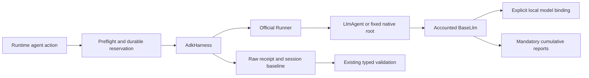

# Google ADK TypeScript execution

Ticket: #8. Parent: [TS port](ts-port.md). Decisions: [ADR 0120](../adr/0120-adk-model-boundary.md), [ADR 0121](../adr/0121-adk-accounting.md).

## Boundary

`AdkHarness` lives in `src/adapters/adk.ts`; importing the core does not load ADK. The local constructor owns native instructions, tools, model factory, prices, revision, and limits. Its identity includes that policy. Default execution constructs an official LlmAgent. An optional fixed root factory returns a BaseAgent or Workflow and declares reviewed injected-model-only behavior. Native custom code is trusted registration code, not portable data or a sandbox. The global model plugin rejects LlmAgent models outside the injected wrapper. AgentTool delegation is unsupported. Native factories and tool callbacks must not make undisclosed model calls directly.

| Contract               | Behavior                                                                                    |
| ---------------------- | ------------------------------------------------------------------------------------------- |
| Model                  | Explicit matching BaseLlm selector and rate provenance; observed reroutes remain incomplete |
| Instructions           | Preconfigured native `instruction`; no per-request override                                 |
| Tools                  | Preconfigured concrete named tools; toolsets and AgentTool are unsupported                  |
| Mode                   | `write` only; no operating-system read-only containment                                     |
| Continuation           | Owned in-memory ADK session and matching baseline; unavailable after restart                |
| Replay                 | Completed ASF receipts replay after restart without ADK dispatch                            |
| Waiting/authentication | Failed receipt; outer execution stops                                                       |
| Bounds                 | Finite underlying model-call and native event counts                                        |
| Cancellation           | Pass AbortSignal; inspect it after iteration; reject late success; close generators         |

ADK's in-process cancellation is cooperative. Local code that never settles cannot be force-stopped by an AbortSignal. Do not use this adapter as a hostile-code containment or hard wall-clock boundary; such execution needs a separate process. The tested late-return model is rejected after abort and its known usage remains recorded.

## Accounting

Each wrapper call keeps its last reported usage snapshot. Completed distinct calls contribute once to cumulative reports. Input excludes cached input. Output includes reported reasoning tokens. Cache creation, tool/service charges, undisclosed provider retries, and invoice adjustments remain outside the declared text-token estimate. Non-text or auxiliary tool-prompt usage fails closed. Missing terminal usage, invalid counts, unpriced models, interruption, or cleanup failure keep a null unknown amount or known subtotal with incomplete status.

`maxLlmCalls` bounds tracked underlying calls per native invocation. Existing `maxDispatches` and nested logical turns bound ASF dispatches, including correction turns. They do not count native reasoning iterations. A native root cannot claim a measured internal allowance unless it uses the wrapper. Root output selection uses explicit `outputFor` metadata when present, or the root-authored final output emitted by this pinned TS SDK. Child observations cannot replace the root result.

## Qualification

The [official TypeScript quickstart](https://adk.dev/get-started/typescript/) recommends Node 24.13+. The published `@google/adk@2.2.0` package has no engine constraint. The account-free proof qualifies this project's Node 22.22.3 target; it does not qualify every SDK feature on Node22. Exact npm package source: [Google ADK JS](https://github.com/google/adk-js/tree/e526b79fdfa98a2c2f994043d7b90cf06a8e50d7). Cancellation follows the [official cancellation contract](https://adk.dev/runtime/cancel/). The optional graph API is experimental.

Tests use actual Runner, LlmAgent, BaseLlm, FunctionTool, BaseAgent, and Workflow objects. No provider transport or credentials are used. `examples/adk-proof.ts` exports `localAdkProof()` for an ordinary Runtime or a trusted portable binding. Live provider qualification requires separate authorization.

## Native export decision

Generated ASF TypeScript drivers remain the supported export. A stateless branch/end native ADK subset can provide a future differential proof. Defer full native export: native checkpoints, waits, retries, parallel scheduling, profiles, and session/accounting ownership do not preserve the ASF contract automatically. No universal export or native round trip is claimed in this delivery.

See [ADK implementation plan](../plans/adk.md).
