# Durable child workflows

Tickets: [#2](https://github.com/asmelkowski/asf-ts/issues/2) and the runtime cancellation seam for [#6](https://github.com/asmelkowski/asf-ts/issues/6). Parent design: [TS port](ts-port.md). Decisions: [0210](../adr/0210-durable-child-workflows.md), [0211](../adr/0211-workflow-limits-and-cancellation.md), [0212](../adr/0212-local-actions-and-storage-compatibility.md), [0213](../adr/0213-schema-dialects-and-source-snapshots.md).

## Public boundary

`WorkflowDefinition` declares `name`, `version`, `identity`, `inputSchema`, `outputSchema`, and `run(scope, input)`. Its optional `document` is the data-only authored graph. The caller must change `identity` when code or relevant dependencies change. Portable execution binds the full semantic closure and trusted registrations through this field.

```typescript
const result = await runtime.workflow("delivery", definition, selectedInput, {
  attempt: 1,
  maxDispatches: 12,
  timeoutMs: 300000,
});
```

The callback receives a `Scope` with `agent`, `command`, `local`, `workflow`, `parallel`, and `signal`. These operations keep the root work directory, run owner, Store, and paid budget. A definition can run standalone or inside multiple parents. `Scope.local(id, identity, callback)` reserves a local effect and retains its JSON output. The caller validates the retained output before business approval. Trusted callbacks must honor the supplied signal; this API is not a sandbox.

`WorkflowResult` contains `passed`, typed `value`, optional `summary`, and provenance: root run ID, qualified invocation ID, parent invocation ID, attempt, definition identity, and selected-input identity. A successful negative verdict is a completed workflow. Native, uncertain, cancelled, timed-out, and schema failures throw.

## Durable transitions

```mermaid
stateDiagram-v2
  [*] --> pending: Bind identity, input, attempt, limits
  pending --> running
  running --> blocked: Unsent preflight gate
  blocked --> running: Resume same binding before deadline
  running --> completed: Retain raw; validate; commit
  running --> failed: Known failure
  running --> cancelled: Parent or group abort
  running --> timeout: Persisted deadline expires
  completed --> completed: Revalidate cached result; no dispatch
```



Failed, cancelled, and timed-out attempts replay their failure. A new explicit attempt receives new IDs. A retained raw aggregate can recover a missing final commit without rerunning the callback. An abandoned local or native reservation cannot resend. Native receipts and accounting remain durable before output validation, including known completions that arrive after cancellation.

## Ownership and bounds

An invocation ID is `<caller-id>/workflow-v1/attempt-01`. Every descendant action has that namespace prefix and a persisted owner. A root caller cannot impersonate a child namespace. Duplicate IDs in one execution and recursive definitions reject.

| Bound               | Meaning                                                                                               |
| ------------------- | ----------------------------------------------------------------------------------------------------- |
| `maxDispatches`     | Optional logical ASF model dispatch allowance; every descendant correction and send consumes one turn |
| Paid Runtime budget | Existing paid send count and soft cost threshold; both remain active                                  |
| `timeoutMs`         | First bound deadline, default 300000 ms, at most 3600000 ms; child cannot outlive its parent          |
| Ancestry            | At most 32 workflow levels                                                                            |
| Parallel group      | At most 256 tasks; first thrown failure aborts siblings and drains all started work                   |

`Scope.parallel` returns values in declaration order. Business `passed: false` does not cancel siblings. Portable all/any joins interpret completed results after this runtime group drains. Portable validation owns writer isolation and finite repeat rules; this runtime seam does not infer workspace safety or native internal model-call counts.

## Inspection and compatibility

`Store.workflowInspect(run, offset = 0, limit = 100)` returns independent bounded windows for `documents`, `definitions`, `workflows`, and `actions`, plus total counts. The maximum window is 200. Each workflow includes exact binding, raw aggregate, typed result, state, deadline, parent, and reserved dispatch count. Definition records reference the first authored document. Action records declare owner, kind, and local identity metadata. Portable lowering can attach its explicit node mapping separately. These rows describe declared relationships; they do not infer causal edges from event timing.

Original v1 stores keep their ledger, receipt, report, session, budget, and event rows. New tables are additive. Ordinary async agent and command workflows keep their public return shapes and lifecycle semantics. Read-only stores that predate composition expose an empty composition view while legacy inspection remains available. Mixed binaries cannot execute new APIs or enforce new quotas.

## Validation and limits

Account-free tests exercise standalone and nested reuse, changed bindings, raw crash recovery, correction resume, shared quota races, paid limits, persistent deadlines, late receipts, cancellation, local uncertainty, drained parallel groups, namespace ownership, schema dialects, bounded inspection, and the exact original schema fixture. Existing runtime and Store tests remain unchanged.

The retained source document is limited to 1 MiB. The runtime cannot force-stop an arbitrary in-process callback that ignores cancellation. Native adapter cleanup remains cooperative. No live provider or invoice qualification is claimed.

Implementation plans: [child workflows](../plans/child-workflows.md), [runtime and roles](../plans/runtime-and-roles.md), [portable files](../plans/portable-files.md), [editor and inspection](../plans/editor-and-inspection.md).
