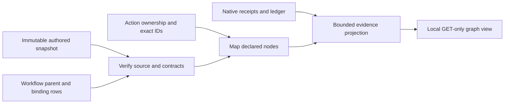

# Declared workflow inspection

Ticket: [#10](https://github.com/asmelkowski/asf-ts/issues/10). Sources: [TS port](ts-port.md), [child workflows](child-workflows.md), [portable files](portable-files.md). Decision: [ADR 0220](../adr/0220-declared-graph-inspection.md).

## Boundary

`buildGraphInspection(store, run, { offset, limit, invocationId })` returns bounded workflow and action windows, source documents, total counts, warnings, and legacy inspection. The optional `invocationId` selects one exact focused workflow outside the current workflow window. The default window is 20; the maximum is 200. Source documents and definitions use their own first-200 window. Missing source or child records remain explicit.

The backend reads the existing Store APIs synchronously. It compares SQLite `data_version` before and after the projection, retries up to three times after external commits, and rejects a continuously changing snapshot. This preserves legacy inspection behavior and prevents a mixed snapshot from becoming a graph claim. The browser DTO types contain only JSON and inspection data; they do not import backend execution modules.

## Mapping rules

| Recorded relationship   | Verification                                                                                          |
| ----------------------- | ----------------------------------------------------------------------------------------------------- |
| Workflow source         | Authored JSON digest, valid format, definition metadata hash, name, version, and input/output schemas |
| Direct action           | Exact persisted owner plus `<invocation>/<node>` and matching model, command, or local kind           |
| Registered inner action | Exact owner plus a path inside that declared custom node namespace                                    |
| Child workflow          | Recorded parent, exact node call path, declared workflow name, and declared attempt                   |
| Repeat child            | Recorded parent, exact `node/iteration-N` path, finite declared range, and attempt 1                  |
| Parallel child          | Recorded parent, exact declared branch ID and workflow name, and attempt 1                            |

The view never constructs transitions from action order, session membership, or event timing. Authored edges are drawn directly from the stored source. A node without loaded receipts is unobserved in the current window. It is not labeled skipped. A complete negative workflow stays `completed` with business `passed: false`. An incomplete or failed workflow has no approved business verdict.

## Evidence and UI

The graph view uses `/graph`, `/graph.js`, `/graph.css`, and GET `/workflow-inspect`. Existing loopback Host, Origin, fetch-site, method, and CSP restrictions apply. These routes have no execution, resume, credential, native-session, arbitrary-file, or publication action.

The browser selects a run, workflow invocation, authored node, exact child, and native/local receipt. Node and SVG controls support keyboard selection. Source data and receipts use text nodes. Child links include exact invocation IDs and bounded target offsets. Workflow proof includes source identity, selected input identity, limits, raw aggregate, typed result, and error. Receipt views retain original encoded evidence.

Recorded replay events are counted for their exact workflow or action ID. Parent replay does not invent descendant replay events. Native turns retain their recorded turn numbers. Cost views use immutable ledger rows. Reports are evidence and are not added again to cost totals. Unknown or partial cost remains visible. Loaded node subtotals do not claim complete invoice cost.

## Validation

Unit fixtures execute actual portable lowering through Runtime. They cover nested negative results, source identity, correction receipts, replay, partial windows, repeat/parallel links, custom inner namespaces, mismatched IDs/kinds, corrupted source, concurrent commits, focused paging, and original v1 stores. Browser acceptance uses account-free recorded fixtures to check keyboard drill-down, exact receipt IDs, source escaping, replay, negative verdicts, pagination, legacy fallback, and GET-only requests. The production HTTP routes serve the same assets from source and built output. See the [recorded browser evidence](../evidence/declared-inspection.md).

Plans: [declared inspection](../plans/declared-inspection.md), [editor and inspection](../plans/editor-and-inspection.md), [portable files](../plans/portable-files.md).
