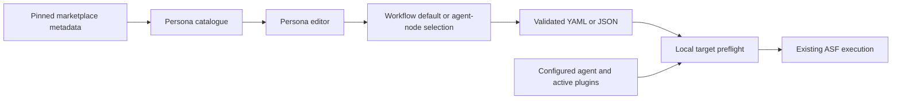

# Persona workbench and marketplace connection

This design extends [profiles](profiles.md), [Studio](studio.md) and [Studio modernization](studio-modernization.md). The wire format remains the shared `profiles` map. The interface calls its entries personas.

## Authoring

Open **Manage personas** from Studio. Select, create, rename or delete a persona. Edit instructions, instruction delivery, model, tools, strict-tool intent, mode, timeout and session intent. Model and tool suggestions come from the connected catalogue; imported values remain visible. System instruction intent uses the native channel only when the target has configured the exact instructions.

Personas are reusable across definitions. Workflow defaults apply to that workflow's agent nodes. An agent-node selection overrides its default. Children retain their own configuration. Rename rewrites all affected assignments while retaining the persona object and unrelated drafts. Delete identifies affected assignments and removes those references atomically. Unapplied source or raw-profile JSON blocks typed mutations. Invalid fields survive selection and keep export disabled.

The advanced profile JSON editor remains available. The structured editor handles malformed imported values without crashing or silently dropping fields. Successful normalized validation preserves persona selection. New/imported documents reset editor ownership.

## Catalogue and plugin intent

`asf-persona-catalogue/v1` contains model names, tool names and plugin descriptors. A descriptor has a catalogue-qualified ID, display name, optional description/source and optional immutable revision. Missing revision means discovery only. Profiles use optional `plugins: [{id, revision}]`; both fields are required in a selected reference. Names and revisions are bounded and duplicates reject.

The Claude-compatible adapter reads metadata only. A pinned local source uses the index's 40-character Git revision. An external Git source needs its own exact revision; optional versions and floating URLs do not qualify. Unknown executable source formats remain unpinned discovery metadata. Do not fetch `$schema`, follow install commands or convert hooks/MCP settings into execution.

The CLI can normalize a local manifest or explicitly fetch its JSON from an immutable raw GitHub URL. Remote reads have a time/size limit, reject redirects and read no plugin code. `serve --persona-catalog` reads a normalized metadata file. Studio can connect another normalized catalogue through a file chooser and same-origin data validation. Its server receives neither arbitrary URLs nor server-file paths from the browser.

## Execution

`ProfileCapabilities.activePlugins` is optional trusted metadata describing plugins actually activated by the local target owner. An explicit requested list must match the exact canonical inventory. Unknown inventory, extra active plugins, missing plugins and revision mismatches reject before reservation. Plugin intent and declared active inventory participate in resolved identity and continuation checks. Overrides replace plugin arrays. Existing tools and native-instruction checks still apply.

Existing profiles and targets omit these fields and keep their behavior and identity. Older readers reject new plugin-bearing documents as unsupported fields. This additive reader extension does not promise native Claude plugin execution on Codex, OpenCode or ADK. Target registration must activate and qualify any supported content through its native interface.

## Acceptance

| Area             | Required evidence                                                                                              |
| ---------------- | -------------------------------------------------------------------------------------------------------------- |
| Persona controls | Actual browser CRUD, all supported fields, both assignment levels and YAML/JSON round trips                    |
| Draft ownership  | Invalid persona fields survive selection; raw JSON/source guards and stale responses retain authority          |
| Plugin selection | Known pinned entries selectable; unpinned entries blocked; unavailable imported requirements remain visible    |
| Runtime          | Exact active inventory passes; unknown/mismatch/duplicates reject; old identity and continuation checks remain |
| Marketplace      | Pinned metadata projection, literal text, bounded reads, exclusive output and no install/code execution        |
| Existing product | Full default gate plus original Studio, inspector and graph browser checks                                     |

Decisions: [structured personas](../adr/0205-structured-persona-authoring.md), [plugin requirements](../adr/0206-marketplace-plugin-requirements.md). Plans: [persona editor](../plans/persona-editor.md) and [marketplace connection](../plans/persona-marketplaces.md).
