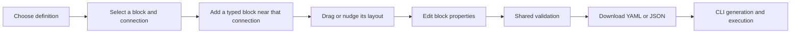

# Studio modernization design

This design extends the [Studio design](studio.md) and its data-only authoring boundary. It addresses the user's five UI observations on 4 October 2026. Runtime generation and execution stay outside the web UI.

## User flow

## Interaction contract

| Observation                               | Change                                                                                        | Acceptance                                                                             |
| ----------------------------------------- | --------------------------------------------------------------------------------------------- | -------------------------------------------------------------------------------------- |
| Mixed light surfaces                      | Shared dark tokens on authoring and both inspectors                                           | All pages remain dark when the browser reports a light preference                      |
| Weak hierarchy and uniform cards          | Separate workspace/library/canvas/properties headings; distinct kind icons, shapes and titles | Selected block and kind remain clear with text and focus styling                       |
| Second branch child appears at the end    | Place from the selected port and keep sibling outcomes in the same downstream stage           | Adding two parallel outcomes preserves both connections and places the blocks together |
| Coordinates are the only movement control | Direct pointer drag plus keyboard and direction buttons                                       | Move under scroll/zoom and with negative imported coordinates; cancel restores layout  |
| Confusing workbench                       | Compact document actions, canvas controls, separate properties, collapsed advanced source     | Desktop and mobile retain access to forms, source, import and export                   |

The selected definition owns node coordinates. Array order remains the serialized definition order. Insertion after a nonterminal block rewires only the chosen port and preserves that port's existing successor. Insertion before a selected end retains the existing behavior: its incoming edges connect to the new block. Collision avoidance affects layout only. Imported positions stay authoritative until the author moves or arranges them.

Drag uses transient geometry until completion. New/imported documents and definition changes reset view state. Panning and zoom change the view, not the document. Movement cannot commit over pending unapplied source. Invalid field drafts survive selection and movement and keep export disabled. Layout changes still require validation before export; validation returns the same semantic identity when layout is the only change.

## Visual and accessibility rules

Use readable dark surfaces, explicit boundaries and larger primary titles. Keep definition selection visible; collapse root/child management to give the block library more space on short screens. Label true/false ports. Use kind names and icons alongside color. Retain native controls and visible focus. Pointer controls target 44 pixels where space permits; this exceeds the [WCAG minimum target criterion](https://www.w3.org/WAI/WCAG22/Understanding/target-size-minimum.html). Direction buttons provide an alternative to dragging. Do not claim a complete accessibility certification from these focused checks.

No external fonts, images or UI packages are required. Imported labels remain literal text. The browser still performs only bounded local reads and document validation; it has no generation, execution, provider or server-file-path operation.

## Validation and implementation links

Run actual Chromium checks against built assets and synthetic stores. Preserve all existing Studio, original-inspector and declared-inspection assertions. Add branch-sibling placement, connection preservation, drag/scroll/zoom, cancel, negative coordinates, keyboard/buttons, invalid-draft guards, and exported-layout round trips. Check source/build/served parity and no external requests or dispatch.

Decisions: [dark workbench](../adr/0203-dark-workflow-workbench.md), [direct layout](../adr/0204-direct-canvas-layout.md). Plans: [visual workbench](../plans/studio-visual-workbench.md) and [direct canvas](../plans/studio-direct-canvas.md). Both plans also use the original Studio design.
