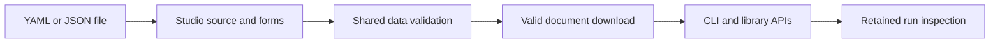

# Studio authoring

Studio edits the distinct `asf-ts-workflow/v1` document. It uses the shared
[portable contract](portable-files.md) and [profile policy](profiles.md).
The existing run inspector remains available at `/`.

## Product boundary

| Studio                                                            | Outside Studio                         |
| ----------------------------------------------------------------- | -------------------------------------- |
| Import a user-selected YAML or JSON file                          | Resolve trusted local target bindings  |
| Edit nodes, ports, schemas, inline children, profiles, and layout | Compile, run, render, or bundle a file |
| Show declared transitions and child contracts                     | Load server paths or native sessions   |
| Validate data and download canonical YAML or JSON                 | Dispatch tools or model calls          |

The catalogue covers agent, command, workflow, branch, end, repeat, parallel, and
custom blocks. Child definitions have their own input and output schemas and default
profile. Compound blocks expose their finite controls. Profiles describe portable
intent. They cannot assert installed capabilities. Runtime preflight still decides
whether a local target can meet native instructions or strict tool requirements.

## Validation and drafts

The editor tracks a document revision, pending field buffers, and pending source.
Every edit disables download immediately. Invalid field text survives selection and
rerendering. Deleting a block removes that block's buffers. A source edit becomes
canonical only after shared validation succeeds. A response for an older revision
cannot approve a newer draft. Download requires the current validated revision.

The server accepts only `{source: string}` JSON bodies at `/studio/validate`.
It limits the request to 1 MiB. The shared parser adds its own source bounds and
rejects duplicate keys, aliases, tags, unknown fields, invalid ports, and unbounded
composition. The response includes the validated document, semantic identity,
warnings, catalogue, and canonical YAML. Serialization does not preserve comments.

## Graph and inspection

SVG edges show explicit `next`, `then`, and `else` transitions. Child contracts
remain available in the property panel. Layout coordinates affect presentation only.
SVG text uses DOM text nodes. Click and keyboard selection share the property panel.
The graph scrolls within its panel on small screens.

The original inspection map groups recorded action scopes and sessions. It does
not become a dependency graph. The editor links to that view without changing its
pagination, accounting, trace omission, or live observation behavior.

## HTTP and privacy

Studio assets use the existing loopback server and restrictive content policy.
Only Studio validation permits same-origin JSON POSTs. Inspection keeps its original
GET-only Origin rule. The endpoint does not write run, action, or event records.
There are no execution, generation, retry, bundle, or file-path routes.

See the [implementation plan](../plans/studio.md),
[boundary decision](../adr/0202-studio-data-boundary.md), and
[browser evidence](../evidence/studio.md).
