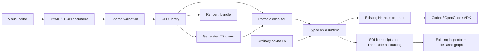

# ASF-TS port design

Source baseline: `bd82062e27407e6cec6799ef22d632a123186d33`. Port reference: [Python PR #21](https://github.com/asmelkowski/asf/pull/21), head `5f6cd638cd7134b2e959861eb2ae2849fd30a181`. This design covers [TS issues #1–#11](https://github.com/asmelkowski/asf-ts/issues).

## Product boundary

The UI edits, validates, and downloads documents. It does not generate code, execute nodes, read server file paths, or change native sessions. The inspector continues to read bounded recorded data. A declared graph overlay uses exact persisted mappings. Code-authored runs retain their scope-lane observation map.

## Analysis and conflict decisions

| Existing TS capability                      | Python addition                      | TS decision                                                                |
| ------------------------------------------- | ------------------------------------ | -------------------------------------------------------------------------- |
| Async functions and reusable agent objects  | Optional graph authoring             | Keep both; lower files to Runtime calls                                    |
| Synchronous reports and immutable ledger    | SDK component receipts               | Use the existing Harness and accounting seam                               |
| Session ownership, model/workdir/policy CAS | Personas and defaults                | Separate portable intent from trusted local bindings                       |
| Bounded correction in the same session      | Child workflow attempts              | Keep correction distinct from caller-owned child attempts                  |
| Root shared paid dispatch budget            | Ancestor limits                      | Add persisted logical ASF-turn limits; no inference-loop claim             |
| Crash reservations and raw receipt replay   | Durable local branch/custom nodes    | Reserve local effects; never repeat uncertain work                         |
| Read-only scope lanes and session rails     | Authoring and exact graph inspection | Preserve lanes; add a separate declared graph view                         |
| Supervised self-improvement                 | Candidate-bound reusable review      | Preserve it; add a separately reusable frozen-candidate workflow           |
| Draft-07 Ajv validation                     | Typed portable boundaries            | Support explicit schema dialects without coercion                          |
| Source module CLI hashing                   | Full portable closure hashing        | Strengthen files and generated drivers; retain old module workflow path    |
| Linux/Node22 baseline                       | Official ADK TS SDK                  | Source-check exact SDK and test compatibility; no Python worker by default |
| Python native-export experiment             | TS native export                     | Assess demand/subset; never silently replace durable ASF execution         |

## Contract

The document has `format`, `root`, a map of workflow definitions, and optional profiles. Each definition declares version, input/output schemas, start node, nodes, and optional layout. References select only explicit inputs or earlier node outputs. The validator checks every incoming path. Native failures throw; successful typed negative results follow declared branches. A child returns typed value, business `passed`, summary, and persisted provenance.

The executor snapshots document, local profile binding identities, and component identities before dispatch. It records qualified action IDs and child invocation IDs. Repeat bounds are finite. Parallel all/any joins drain every started child. Concurrent effectful nodes require isolation and are rejected in this first format. Unknown cost stays unresolved. ADK owns internal agent/graph execution beneath its Harness boundary; ASF owns outer order and durable reservation.

## Non-goals

No hosted multiuser editor, provider credential manager, distributed scheduler, automatic publication, universal native-code round trip, or additional agentic frameworks. No paid live probe is authorized by offline acceptance. Generated ASF drivers are the supported output; native export needs a separately documented supported subset.

## Plan links

[Runtime and roles](../plans/runtime-and-roles.md), [portable files](../plans/portable-files.md), [candidate and ADK](../plans/candidate-and-adk.md), and [editor and inspection](../plans/editor-and-inspection.md) derive from this design and each specialist design. Plans can share designs.
