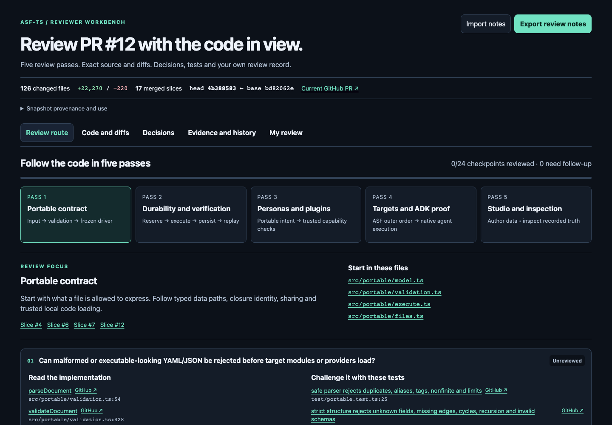

# PR 12 review guide

This standalone guide helps a reviewer inspect [upstream PR 12](https://github.com/asmelkowski/asf-ts/pull/12). Keep the guide PR separate and unmerged, as requested by the user.

Delivery uses a draft PR in `asmelkowski/asf-ts`, targeting `main` and linked from PR 12. Upstream has no integration branch. This branch adds only guide documents; the HTML reviews the product snapshot below.

## Open the guide

Download [pr12-review.html](pr12-review.html) with GitHub's **Download raw file** action. Open the saved file in a browser. The guide needs no ASF service, account or network connection. GitHub displays the file as source; download it to use its controls.

1. Select one of the five review passes.
2. Open a checkpoint's implementation or test link. The embedded viewer shows exact source lines, head/base source and unified diffs.
3. Inspect the decisions, evidence scope and smaller PR history.
4. Set your own checkpoint status and notes. Export JSON for later import, or Markdown to share the review record.

The guide starts unreviewed. It stores notes in the browser for this snapshot. It does not post comments or approvals. Import requires the same base and head. A later edit, reset or newer import takes precedence over a pending import.

## Snapshot

| Item                | Value                                                              |
| ------------------- | ------------------------------------------------------------------ |
| Product head        | `4b3885838c7c6266808529310b3f3f39833889cd`                         |
| Base main           | `bd82062e27407e6cec6799ef22d632a123186d33`                         |
| Change set          | 126 changed files; +22,270 / −220 lines                            |
| Reference files     | One unchanged regression file                                      |
| Review route        | 24 checkpoints across five areas                                   |
| Integration history | 17 merged smaller PRs                                              |
| Guide SHA-256       | `0b8b020e4d2f6cd9f8d01816d5d8f481d7eb614f1991f8772d267ab1c31c7847` |

All source and document links use the product head. The current GitHub PR link is labeled separately. Compare the PR's current head with the guide before applying its review record. The guide does not refresh itself from GitHub.

## Validation

Independent comparison verified every embedded head/base source, diff and SHA-256 against Git: 126 changed files plus one reference file, with 206 in-range checkpoint references. The linked aggregate CI passed at the product head: 272 total tests, 270 passing, zero failures and two existing opt-in native CLI skips.

The main-based guide branch also ran the older upstream checks. Typecheck, lint, formatting and build passed. Of 132 tests, 128 passed, two failed and two existing opt-in checks were skipped. The unchanged baseline tests fail on an unavailable `/bin/true` path (`test/process.test.ts:59`) and an uncertain command replay request (`test/self-improvement-workflow.test.ts:353`, `Action request changed: host-0/check`). This guide PR changes no product or test files. These baseline failures are separate from the passing 270-test product integration evidence above.

The guide's own Chromium checks are separate. [Interaction acceptance](interaction-acceptance.json) records actual downloads and reimport, maximum-length Unicode/escaped notes, search wrapping, and stale-import ownership. [Appearance acceptance](appearance-acceptance.json) records navigation, code/decision controls and responsive checks. Both identify the exact guide bytes. No external requests or provider calls are needed.

See [ADR 0207](../adr/0207-review-guide-snapshot.md) for the snapshot and delivery decision.
